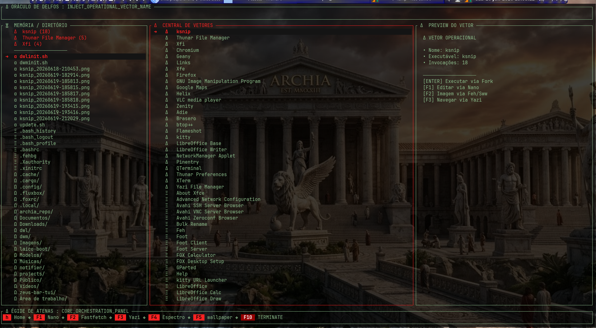
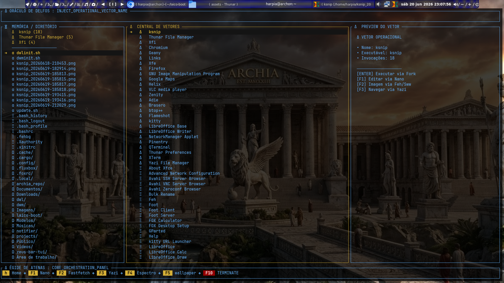
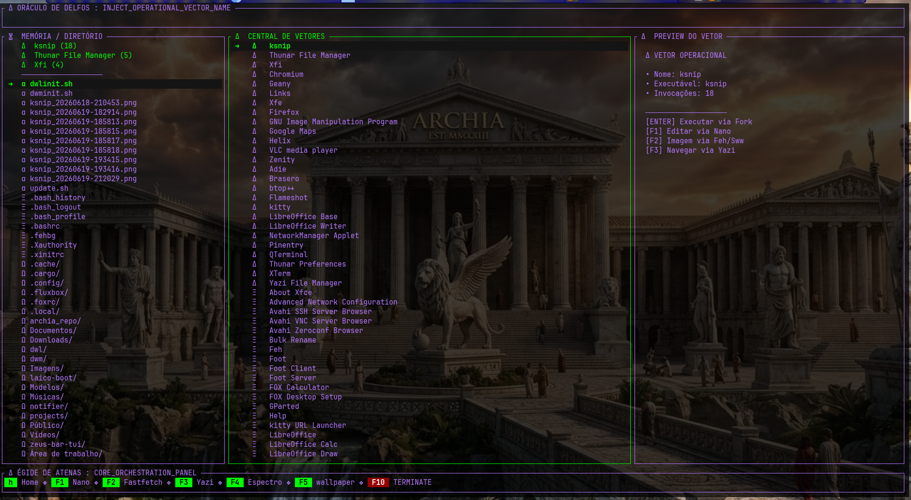
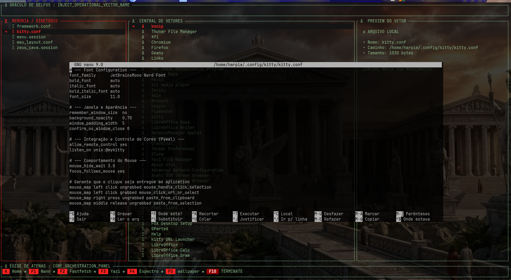
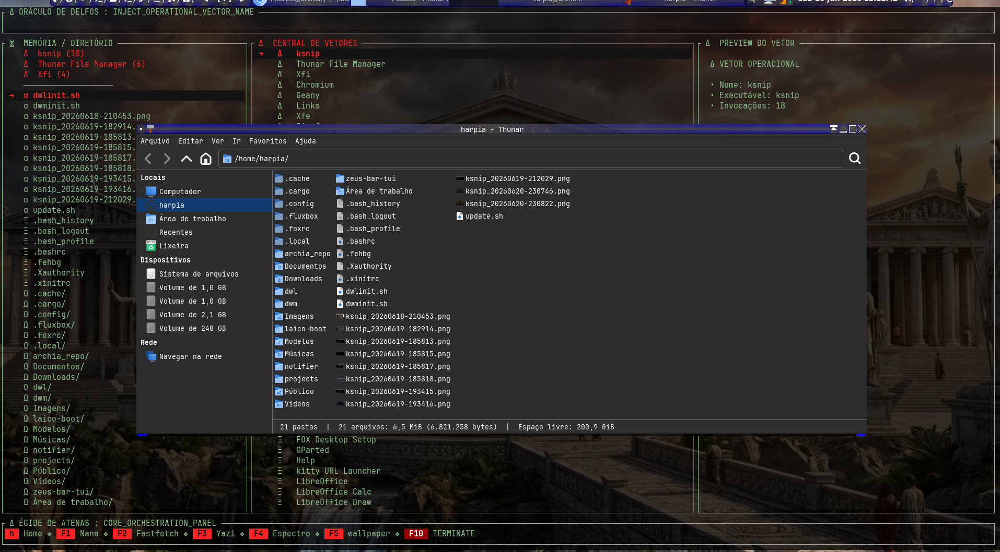
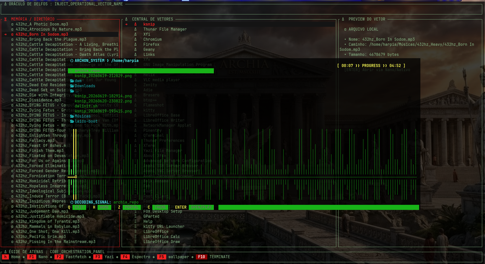
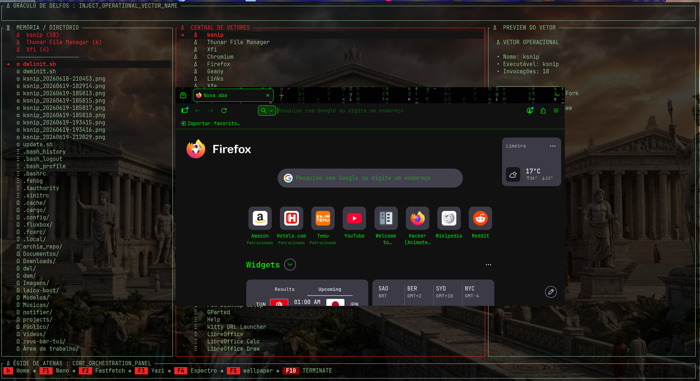

# 🏛️ Projeto Archia (laico-boot) - Guia de Configuração e Dependências
[](https://opensource.org)

## 📸 Demonstração Visual do Ecossistema

### Interface Principal e Temas




### Integração com os Vetores Operacionais





---

Este documento centraliza todas as dependências de sistema, ferramentas de terminal (TUIs) e os passos necessários para compilar e implantar o launcher atualizado.

---

## 🛠️ 1. Dependências do Sistema (Arch Linux)

Antes de compilar o projeto, certifique-se de instalar as ferramentas base e os utilitários gráficos/CLI necessários para rodar os vetores no **dwm (X11)** e no **dwl (Wayland)**.

Execute o comando abaixo no terminal para instalar tudo de uma vez:

```bash
sudo pacman -S --needed base-devel rustup fastfetch yazi nano kitty qterminal foot feh swww xcompmgr
```

### Detalhes das Ferramentas Usadas por Ambiente:

#### 🖥️ Servidor Gráfico e Estilo
* **`feh` / `xcompmgr`:** Utilizados no **dwm (X11)** para renderizar os papéis de parede e gerenciar os efeitos de transparência da TUI.
* **`swww`:** Daemon de wallpaper de alta performance acelerado por GPU utilizado no **dwl (Wayland)**.

#### 🐚 Emuladores de Terminal (Abertura de Janelas Flutuantes)
* **`kitty` / `qterminal`:** Chamados automaticamente pelo launcher quando executado em uma sessão **dwm (X11)**.
* **`foot`:** Terminal ultraveloz e nativo do Wayland, invocado pelo launcher durante as sessões no **dwl (Wayland)**.

#### 🧰 Utilitários de Terminal Base
* **`nano` (Atalho F1):** Editor de texto simples para modificações rápidas direto no terminal.
* **`fastfetch` (Atalho F2):** Exibe informações de hardware e software do Arch Linux com o logo em arte ASCII.
* **`yazi` (Atalho F3):** Gerenciador de arquivos assíncrono moderno e ultraveloz escrito em Rust.

---

## ⚙️ 2. Configuração do Ambiente Rust

Para garantir que o compilador do Rust consiga processar o código com as chamadas nativas do Linux (`libc`), configure o toolchain padrão:

```bash
rustup default stable
```

---

## 📦 3. Dependências do Projeto (`Cargo.toml`)

O seu arquivo `Cargo.toml` na raiz do projeto deve conter as seguintes crates para que a interface de terminal e os forks funcionem:

```toml
[package]
name = "archia"
version = "0.1.0"
edition = "2021"

[dependencies]
crossterm = "0.27"
ratatui = "0.26"
libc = "0.2"
```

---

## 🚀 4. Guia de Compilação e Implantação

Toda vez que fizer alterações no código fonte (`src/main.rs`), siga estes passos exatos para limpar o cache antigo, compilar a versão final e atualizar o binário no caminho prioritário do sistema:

### Passo 1: Limpar o cache e compilar em modo otimizado
```bash
cargo clean
cargo build --release
```

### Passo 2: Atualizar o binário no diretório do usuário
```bash
cp target/release/archia ~/.cargo/bin/laico-boot
```

### Passo 3: Forçar a reinicialização da interface
```bash
killall laico-boot
laico-boot
```

---

## 🛡️ 5. Mapeamento de Atalhos Operacionais

O painel central de orquestração agora responde ao seguinte espectro de comandos:

* [**H**] **Home:** Retorna para a tela ou visão principal do painel central.
* [**F1**] **Nano:** Abre o editor de texto Nano suspendendo o menu de forma limpa.
* [**F2**] **Fastfetch:** Renderiza os dados do sistema e segura a tela até um Enter ser pressionado.
* [**F3**] **Yazi:** Executa o navegador de arquivos em terminal de alta performance.
* [**F4**] **Espectro:** Inicializa ou alterna o visualizador/módulo Espectro do sistema.
* [**F5**] **Wallpaper:** Inicializa o gerenciador universal de wallpapers (detecta Wayland/X11 automaticamente).
* [**F10**] **TERMINATE:** Encerra imediatamente a execução do launcher e restaura o terminal original.

